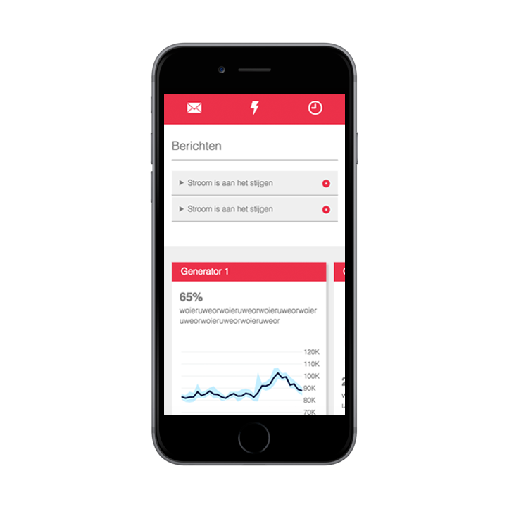

<h1 align="center">
  
  <br>
  <br>
  Sigma
</h1>
<br>

## The app
This app makes sure the infra-team working on a festival gets to know what needs to be done, before it needs to be done. Our app shows incoming status updates, these updates can be based on an algorithm that checks if the voltage peak is rapidly increasing/decreasing or if a generator is low on its 2G budget. Besides the messages the infra-team can see a real-time graph that displays the voltage usage of a generator.

## Features
-  [x] progressive web app
-  [x] algorithm that predicts when a generator is gonna spike or not
-  [x] real-time notifications about different issues concerning the generators
-  [x] real-time D3.js graph that shows how much voltage is used per minute
-  [x] history of old notifications

## Build
To run the application:
```bash
git clone
```

To use the app you need to run the following commands:
```bash
npm install
```

To install the Node dependencies.

```bash
npm start
```

To start the server.

## Wishlist
-  [ ] multiple working graphs
-  [ ] uploading new timetables to the app
-  [ ] getting real 2G credit data that sends a notification once its low

## Team

 |  |  |
---|---|---
[Luuk Hafkamp](https://github.com/lhafkamp) | [Sjoerd Beentjes](https://github.com/Sjoerdbeentjes) | [Merlijn Vos](https://github.com/Murderlon) |

## Sources

<a href="https://d3js.org/">d3.js</a>
<a href="https://socket.io/">socket.io</a>
